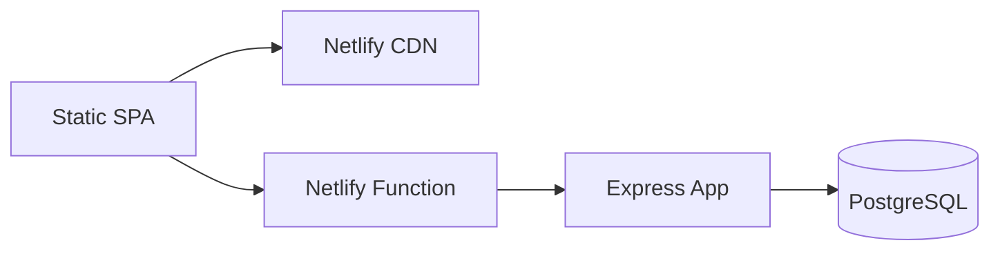

# Community Auth Platform


Full-stack community platform with authentication, profiles, social feed, friend requests, direct messaging, and notifications. The product UI is branded **Flödet** (Swedish).

## Live Demo

https://community-auth-platform.netlify.app

## Screenshots

### Feed


### Profile


### Messages


## Features

- JWT authentication with registration, login, and password recovery
- User profiles with avatar, cover color, and timeline posts
- Personal feed and global wall with likes, comments, and shares
- Friend requests and accepted-friends-only direct messaging
- Read receipts and delivery status for messages
- Real-time unread badges via SSE (with polling fallback)
- OpenAPI 3.1 specification and GitHub Actions CI

## Tech Stack

- **Frontend:** Vanilla SPA (`public/`) with hash routing
- **Backend:** Express + TypeScript, bundled for Netlify Functions
- **Database:** PostgreSQL (Neon in production, Docker locally)
- **Security:** bcrypt, JWT, Helmet, CORS, HTML sanitization, rate limiting patterns

## Architecture



## Local Development

```bash
git clone https://github.com/Elli2022/community-auth-platform.git
cd community-auth-platform
cp .env.example .env
npm install
npm run db:up
npm run dev
```

Open http://127.0.0.1:3000

### Tests

```bash
npm test
```

Requires `DATABASE_URL` (see `.env.example`).

## Environment Variables

| Variable | Required | Description |
|----------|----------|-------------|
| `DATABASE_URL` | Yes | PostgreSQL connection string |
| `JWT_SECRET` | Production | Secret for signing JWTs |
| `PUBLIC_SITE_URL` | Production | Base URL for password-reset links |
| `RESEND_API_KEY` | Production | Sends forgot-password / forgot-username emails via [Resend](https://resend.com) |
| `EMAIL_FROM` | Production | Verified sender, e.g. `Flödet <noreply@yourdomain.com>` |
| `ALLOW_DEV_RECOVERY_FALLBACK` | Local only | `true` shows reset link/username in the UI when Resend is not configured — never set on Netlify |

### Email recovery (Netlify)

1. Create a Resend API key and add `RESEND_API_KEY` to the site’s **Production** environment variables.
2. Set `EMAIL_FROM` to a domain you verified in Resend (or use Resend’s test sender for development).
3. Redeploy. Users then get a generic confirmation in the UI; credentials are only sent by email.
4. For local dev without Resend, set `ALLOW_DEV_RECOVERY_FALLBACK=true` in `.env`.

## API Documentation

- [docs/openapi.yaml](./docs/openapi.yaml)
- Production spec: `/openapi.yaml` on the deployed site

## Project Structure

```
public/              # SPA (Flödet UI)
netlify/functions/   # Serverless API entry
src/app/             # Express routes, use cases, repositories
docs/openapi.yaml    # API specification
prisma/              # Not used — SQL migrations in src/app/db
```

## License

ISC
