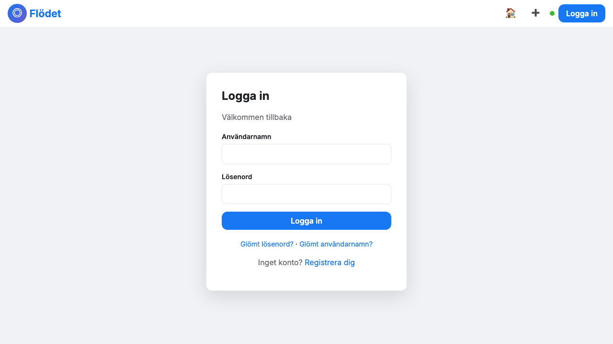
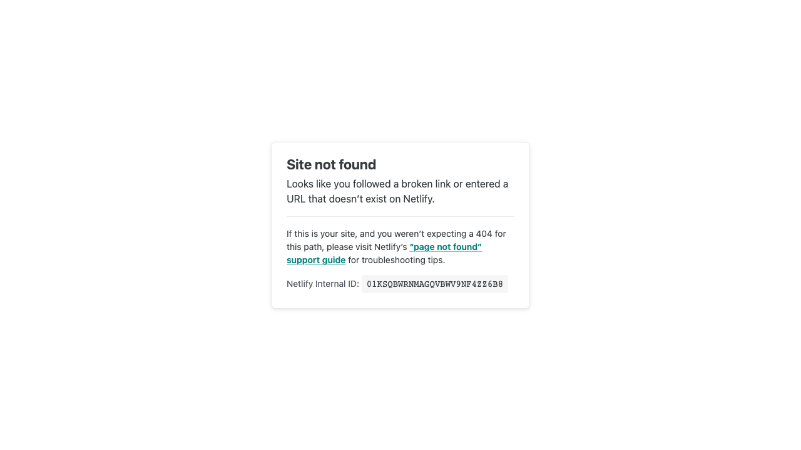
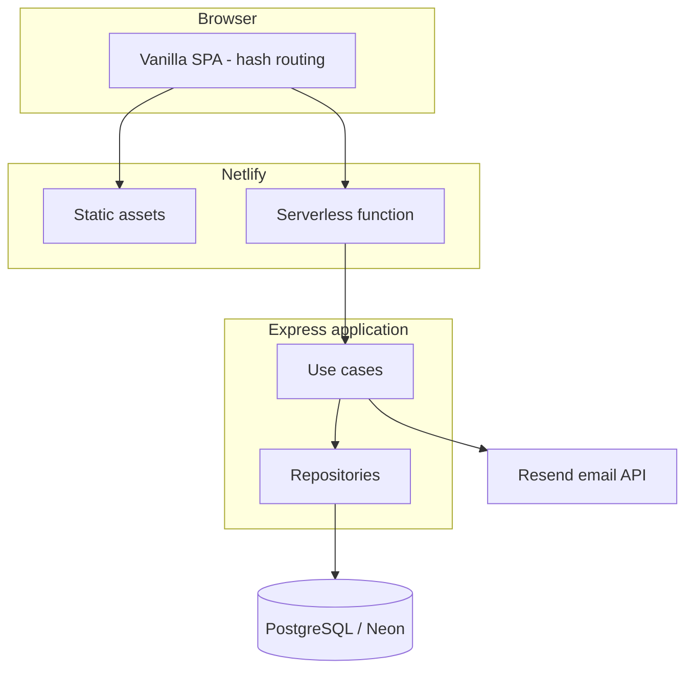

# Community Hub

[](https://github.com/Elli2022/community-hub/actions/workflows/ci.yml)


Production-style full-stack community app: authentication, profiles, social feed, friend graph, direct messaging, and notifications. The UI product name is **Community Hub** (Swedish).

**Live demo:** [community-auth-platform.netlify.app](https://community-auth-platform.netlify.app)

## Why this project

I built this to practice end-to-end product delivery—not a tutorial clone. The focus is realistic flows recruiters care about: secure auth, data modeling, API design, deployable architecture, and a usable interface.

## Highlights (what to look at in a review)

- **Layered backend:** Express routes → use cases → repositories over PostgreSQL (clear separation for testing and changes).
- **Serverless production:** Single Express app packaged as a Netlify Function with static SPA on CDN.
- **Security-minded auth recovery:** Generic API responses (no account enumeration); credentials are emailed, not shown in the UI in production.
- **Social domain model:** Wall posts, likes/comments/shares, friend requests, DM threads with read/delivery state.
- **Live updates:** SSE for unread badges with polling fallback.
- **Contract-first API:** OpenAPI 3.1 spec + CI on every push.

## Screenshots

| Feed | Profile | Messages |
|------|---------|----------|
|  |  |  |

## Architecture



## Tech stack

| Layer | Choice | Rationale |
|-------|--------|-----------|
| Frontend | Vanilla TS/JS SPA | Small bundle, no framework lock-in for this scope |
| Backend | Express + TypeScript | Familiar HTTP model, easy to test use cases |
| Database | PostgreSQL | Relational fit for users, friendships, messages |
| Auth | JWT + bcrypt | Stateless API tokens; hashed passwords at rest |
| Deploy | Netlify Functions + Neon | Low ops, fast demos, production-like env vars |
| Email | Resend | Transactional mail for password/username recovery |

## Security notes

- Passwords hashed with bcrypt; JWT for session/API auth.
- HTML sanitization and Helmet/CORS on the API.
- Recovery endpoints return the same message whether or not the email exists.
- Production builds do **not** expose reset links or usernames in the browser when email is configured.
- Secrets (`JWT_SECRET`, `DATABASE_URL`, `RESEND_API_KEY`) live in environment variables only.

## Local development

```bash
git clone https://github.com/Elli2022/community-hub.git
cd community-hub
cp .env.example .env
npm install
npm run db:up
npm run db:migrate
npm run dev
```

Open http://127.0.0.1:3000

Without Resend, add to `.env` for local recovery testing:

```env
ALLOW_DEV_RECOVERY_FALLBACK=true
```

### Tests

```bash
npm test
```

## Environment variables

| Variable | Required | Description |
|----------|----------|-------------|
| `DATABASE_URL` | Yes | PostgreSQL connection string |
| `JWT_SECRET` | Production | Signs JWTs |
| `PUBLIC_SITE_URL` | Production | Base URL in recovery emails |
| `RESEND_API_KEY` | Production | Sends recovery email via [Resend](https://resend.com) |
| `EMAIL_FROM` | Production | Verified sender address |
| `ALLOW_DEV_RECOVERY_FALLBACK` | Local only | Shows reset link/username in UI when email is off |

## API documentation

- Repo: [docs/openapi.yaml](./docs/openapi.yaml)
- Deployed: `/openapi.yaml` on the live site

## Project structure

```
public/              # SPA (Community Hub UI) + screenshots
netlify/functions/   # Serverless API entry
src/app/             # Express app, use cases, repositories
docs/openapi.yaml    # API specification
```

## Interview talking points

1. **Tradeoff:** Monolith Express in one function vs. split microservices—chose monolith for portfolio clarity and lower cold-start complexity.
2. **Recovery flow:** Designed against enumeration and accidental credential leaks when `NODE_ENV` is inlined at bundle time (explicit dev fallback flag).
3. **Scaling path:** Repositories isolate SQL; could add read replicas, queue for notifications, or WebSockets without rewriting use cases.
4. **AI usage:** Used AI for scaffolding and iteration; architecture, security rules, deploy config, and review decisions are intentional and documented here.

## License

ISC
